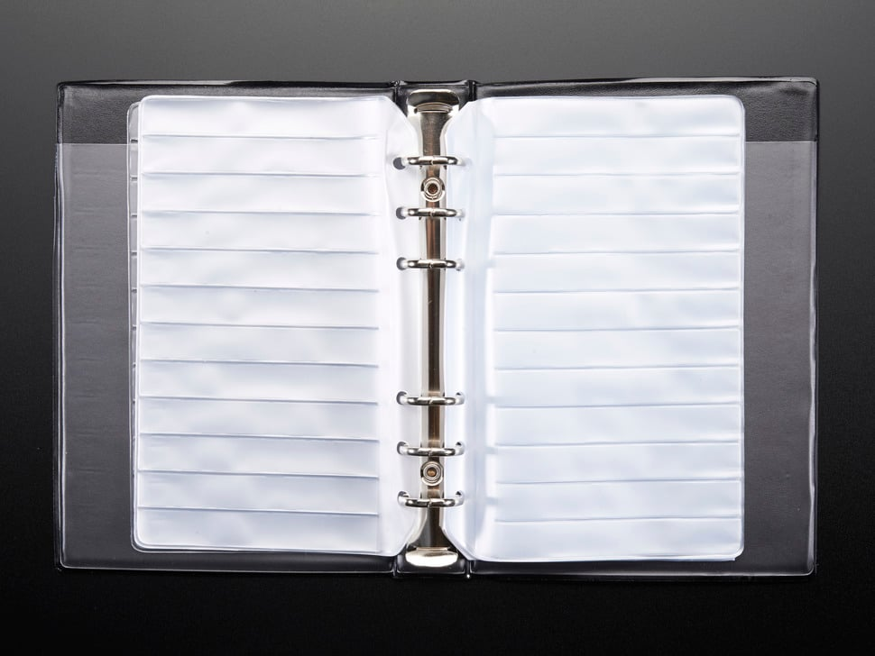

# PCB_Prototype_Board
A PCB prototype board is a temporary printed circuit board used for testing and validating electronic designs before mass production. It helps ensure functionality, detect errors, and make adjustments efficiently.


# Site

```
https://robu.in/
https://www.ktron.in/
https://www.sunrom.com/
```


**Other_sites**

```
https://roboway.in
https://sharvielectronics.com
https://techtonics.in
https://electronicspices.com
https://kitsguru.com/
https://robodo.in
```


### DB25 Port Connector Pinout Configuration


| No | Board_Jpg | Board_size  |Price  |Hole Pitch |  Pin_Description |Site | 
| --- |  --- | ---  | --- |---  | --- |--- |
| 1 |   | 2*8 CM  | 8 | 2.54mm | Single-Sided |robu |
| 2 |   | 5*7 CM  | 28 | 2.54mm | Single-Sided |robu |
| 2A |   | 5*7 CM  | 14 | 2.54mm | Single-Sided |ktron |
| 3 |   | 6*8 CM  | 33 | 2.54mm | Single-Sided |robu |
| 3A |   | 6*4 CM  | 43 | 2.54mm | Single-Sided |ktron |
| 4 |   | 7*9 CM  | 41 | 2.54mm | Single-Sided |robu |
| 5 |   | 8*12 CM  | 60 | 2.54mm | Single-Sided |robu |
| 6 |   | 9*15 CM  | 80 | 2.54mm | Single-Sided |robu |
| 7 |   | 10*10 CM  | 65 | 2.54mm | Single-Sided |robu |
| 8 |   | 10*15 CM  | 94 | 2.54mm | Single-Sided |robu |
| 9 |   | 10*22 CM  | 135 | 2.54mm | Single-Sided |robu |
| 10 |   | 12*18 CM  | 135 | 2.54mm | Single-Sided |robu |
| 11 |   | 13*25 CM  | 181 | 2.54mm | Single-Sided |robu |
| 12 |   | 15*20 CM  | 174 | 2.54mm | Single-Sided |robu |
| 13 |   | 18*30 CM  | 254 | 2.54mm | Single-Sided |robu |
| 14 |   | 20*30 CM  | 407 | 2.54mm | Single-Sided |robu |
| --- |  --- | Double-Sided  | --- |---  | --- |--- |
| 1 |   | 2*8 CM  | 9 | 2.54mm | Double-Sided |robu |
| 2 |   | 7*9 CM  | 50 | 2.54mm | Double-Sided |robu |
| 3 |   | 8*12 CM  | 107 | 2.54mm | Double-Sided |robu |
| 4 |   | 20*30 CM  | 443 | 2.54mm | Double-Sided |robu |
| --- |  --- | Copper Clad Blank PCB   | --- |---  | --- |--- |
| 1 |   | 10*15 CM  | 62 |  | Single-Sided |robu |
| 2 |   | 15*20 CM  | 120 |  | Single-Sided |robu |
| 3 |   | 20*30 CM  | 221 |  | Single-Sided |robu |
| 4 |   | 20*20 CM 8X8 Inch   | 177 |  | Single-Sided |ktron |
| --- |  --- | Local_Shop   | --- |---  | --- |--- |
| 1 |   | 7*5 CM 3X2 Inch   | 15 | 2.54mm | Single-Sided |Geevee |
| 2 |   | 7*9.5 CM 4X3 Inch   | 30 | 2.54mm | Single-Sided |Geevee |
| 3 |   | 15*10 CM 6X4 Inch   | 55 | 2.54mm | Single-Sided |Geevee |


---

* **FRC** → usually “Flat Ribbon Cable” (multi-wire cable, not a connector).
* **FFC** → “Flat Flexible Cable” (thin, plastic, printed copper traces, looks like a ribbon).
* **FPC** → “Flexible Printed Circuit” (flexible PCB, can hold components, not just cable).

⚡ So:

* **FRC** = cable type (wires).
* **FFC** = flat cable with printed conductors.
* **FPC** = actual flexible circuit board.


* **FRC (Flat Ribbon Cable)** →
  Pitch = usually **1.27 mm** (0.05") between conductors. Standard for IDC connectors.

* **FFC (Flat Flexible Cable)** →
  Pitch comes in many sizes: **0.3 mm, 0.5 mm, 0.8 mm, 1.0 mm, 1.25 mm, 2.54 mm**.
  Most common = **0.5 mm** or **1.0 mm**.

* **FPC (Flexible Printed Circuit)** →
  Pitch depends on connector design, typically same as FFC (0.3–1.0 mm). Since it’s a PCB, pitch can be customized to need.

👉 In short:

* **FRC** = coarse pitch (1.27 mm).
* **FFC/FPC** = fine pitch (0.3–1.0 mm typical).


Here’s the comparison table 👇

| Type    | Full Form                | Typical Pitch                                                                     | Structure                                                       | Common Uses                                                   |
| ------- | ------------------------ | --------------------------------------------------------------------------------- | --------------------------------------------------------------- | ------------------------------------------------------------- |
| **FRC** | Flat Ribbon Cable        | **1.27 mm (0.05")**, sometimes 2.54 mm                                            | Multi-wire insulated cable, wires run parallel                  | IDE cables, old floppy/HDD cables, industrial control wiring  |
| **FFC** | Flat Flexible Cable      | **0.3 mm, 0.5 mm, 0.8 mm, 1.0 mm, 1.25 mm, 2.54 mm** (most common 0.5 mm, 1.0 mm) | Thin plastic film with flat copper conductors printed/laminated | Laptop display to motherboard, printers, cameras              |
| **FPC** | Flexible Printed Circuit | Custom, usually **0.3 – 1.0 mm** (depends on connector)                           | Flexible PCB with etched copper traces; can mount components    | Smartphones, wearables, foldable devices, compact electronics |

⚡ Quick view:

* **FRC** → thick, coarse pitch cable (legacy/industrial).
* **FFC** → thin, flat cable (mostly connectors).
* **FPC** → full flexible circuit board (more advanced).


| No | Board_Jpg | Code | Price | Item Description                                   | Type      |Site | 
| -- | --- | ---- | ----- | -------------------------------------------------- | --------- |--- |
| 1|   | 6815 | Rs.15 | 4P 1mm Pitch - 150mm FFC Cable       | Cable     |sunrom |
| 2|   | 6816 | Rs.16 | 5P 1mm Pitch - 150mm FFC Cable       | Cable     |sunrom |
| 3|   | 6817 | Rs.17 | 6P 1mm Pitch - 150mm FFC Cable       | Cable     |sunrom |
| 4|   | 6818 | Rs.18 | 8P 1mm Pitch - 150mm FFC Cable       | Cable     |sunrom |
| 5|   | 6819 | Rs.20 | 10P 1mm Pitch - 150mm FFC Cable       | Cable     |sunrom |
| 6|   | 6820 | Rs.24 | 12P 1mm Pitch - 150mm FFC Cable       | Cable     |sunrom |
| 7|   | 6821 | Rs.26 | 14P 1mm Pitch - 150mm FFC Cable       | Cable     |sunrom |
| 8|   | 6822 | Rs.28 | 16P 1mm Pitch - 150mm FFC Cable       | Cable     |sunrom |
| 9|   | 6823 | Rs.30 | 18P 1mm Pitch - 150mm FFC Cable       | Cable     |sunrom |
| 10|   | 6824 | Rs.32 | 20P 1mm Pitch - 150mm FFC Cable       | Cable     |sunrom |
| 11|   | 6825 | Rs.34 | 22P 1mm Pitch - 150mm FFC Cable       | Cable     |sunrom |
| 12|   | 6826 | Rs.36 | 24P 1mm Pitch - 150mm FFC Cable       | Cable     |sunrom |
| 13|   | 6827 | Rs.38 | 26P 1mm Pitch - 150mm FFC Cable       | Cable     |sunrom |
| 14|   | 6828 | Rs.40 | 28P 1mm Pitch - 150mm FFC Cable       | Cable     |sunrom |
| 15|   | 6829 | Rs.42 | 30P 1mm Pitch - 150mm FFC Cable       | Cable     |sunrom |
| 16|   | 6800 | Rs.10 | 4P 1mm Flip Lock FFC/FPC Bottom Contact Connector  | Connector |sunrom |
| 17|   | 6801 | Rs.12 | 5P 1mm Flip Lock FFC/FPC Bottom Contact Connector  | Connector |sunrom |
| 18|   | 6802 | Rs.13 | 6P 1mm Flip Lock FFC/FPC Bottom Contact Connector  | Connector |sunrom |
| 19|   | 6803 | Rs.15 | 8P 1mm Flip Lock FFC/FPC Bottom Contact Connector  | Connector |sunrom |
| 20|   | 6804 | Rs.18 | 10P 1mm Flip Lock FFC/FPC Bottom Contact Connector | Connector |sunrom |
| 21|   | 6805 | Rs.20 | 12P 1mm Flip Lock FFC/FPC Bottom Contact Connector | Connector |sunrom |
| 22|   | 6806 | Rs.22 | 14P 1mm Flip Lock FFC/FPC Bottom Contact Connector | Connector |sunrom |
| 23|   | 6807 | Rs.25 | 16P 1mm Flip Lock FFC/FPC Bottom Contact Connector | Connector |sunrom |
| 24|   | 6808 | Rs.28 | 18P 1mm Flip Lock FFC/FPC Bottom Contact Connector | Connector |sunrom |
| 25|   | 6809 | Rs.30 | 20P 1mm Flip Lock FFC/FPC Bottom Contact Connector | Connector |sunrom |
| 26|   | 6810 | Rs.32 | 22P 1mm Flip Lock FFC/FPC Bottom Contact Connector | Connector |sunrom |
| 27|   | 6811 | Rs.35 | 24P 1mm Flip Lock FFC/FPC Bottom Contact Connector | Connector |sunrom |
| 28|   | 6812 | Rs.36 | 26P 1mm Flip Lock FFC/FPC Bottom Contact Connector | Connector |sunrom |
| 29|   | 6813 | Rs.37 | 28P 1mm Flip Lock FFC/FPC Bottom Contact Connector | Connector |sunrom |
| 30|   | 6814 | Rs.38 | 30P 1mm Flip Lock FFC/FPC Bottom Contact Connector | Connector |sunrom |


## FRC 

```
https://www.sunrom.com/c/frc-idc-flat-cable-box-header
```


https://robu.in/product-category/batteries/wires-and-cables/multi-color-project-cables/frc-cable/


* **FPC Cable (A-Type)** → Flexible Printed Circuit cable, used with ZIF/FPC connectors.
* **Pitch** = distance between adjacent conductors.

### From robu.in: 

1. **0.5 mm Pitch, 10-pin, 200 mm, A-Type**

   * Very fine pitch.
   * Used in compact devices (displays, cameras, etc.).
   * Needs 0.5 mm pitch connector.

2. **1.0 mm Pitch, 6-pin, 200 mm, A-Type**

   * Larger pitch, easier to handle.
   * Used in modules, adapters, boards with 1.0 mm FPC connectors.
   * More robust than 0.5 mm pitch.

### Key Difference

* **0.5 mm pitch** = denser, smaller, more fragile.
* **1.0 mm pitch** = bigger spacing, easier soldering, more durable.

👉 Both are **FPC A-Type** (contacts on the same side).

  
  

### Header Strips (1.27mm, 2mm, 2.54mm)


```
https://www.sunrom.com/c/header-strips?s_98%5B%5D=1.27

```


| No | Code | Board\_Jpg | Description                                               | Price    | Pitch  | Type          | Site |
| -- | ---- | ---------- | --------------------------------------------------------- | -------- | ------ | ------------- | ---- |
| 1  | 7874 |   | 2x9 18P Female Straight Double Row Header Strip           | Rs.11.30 | 2.54mm | Female Header | sunrom|
| 2  | 7875 | —          | 2x10 20P Female Straight Double Row Header Strip          | Rs.11.60 | 2.54mm | Female | sunrom|
| 3  | 7876 | —          | 2x12 24P Female Straight Double Row Header Strip          | Rs.12.10 | 2.54mm | Female | sunrom|
| 4  | 7877 | —          | 2x20 40P Female Straight Double Row Header Strip          | Rs.23.10 | 2.54mm | Female | sunrom|
| 5  | 7863 | —          | 1x12 Female Right Angle Single Row Header Strip           | Rs.23.10 | 2.54mm | Female | sunrom|
| 6  | 7864 | —          | 1x15 Female Right Angle Single Row Header Strip           | Rs.29.40 | 2.54mm | Female | sunrom|
| 7  | 7865 | —          | 1x16 Female Right Angle Single Row Header Strip           | Rs.30.90 | 2.54mm | Female | sunrom|
| 8  | 7866 | —          | 1x20 Female Right Angle Single Row Header Strip           | Rs.37.10 | 2.54mm | Female | sunrom|
| 9  | 7867 | —          | 2x2 4P Female Straight Double Row Header Strip            | Rs.5.00  | 2.54mm | Female | sunrom|
| 10 | 7868 | —          | 2x3 6P Female Straight Double Row Header Strip            | Rs.5.80  | 2.54mm | Female | sunrom|
| 11 | 7869 | —          | 2x4 8P Female Straight Double Row Header Strip            | Rs.6.60  | 2.54mm | Female | sunrom|
| 12 | 7870 | —          | 2x5 10P Female Straight Double Row Header Strip           | Rs.7.50  | 2.54mm | Female | sunrom|
| 13 | 7871 | —          | 2x6 12P Female Straight Double Row Header Strip           | Rs.8.30  | 2.54mm | Female | sunrom|
| 14 | 7872 | —          | 2x7 14P Female Straight Double Row Header Strip           | Rs.9.90  | 2.54mm | Female | sunrom|
| 15 | 7873 | —          | 2x8 16P Female Straight Double Row Header Strip           | Rs.10.80 | 2.54mm | Female | sunrom|
| 16 | 7859 | —          | 1x5 Female Right Angle Single Row Header Strip            | Rs.12.40 | 2.54mm | Female | sunrom|
| 17 | 7860 | —          | 1x6 Female Right Angle Single Row Header Strip            | Rs.13.10 | 2.54mm | Female | sunrom|
| 18 | 7861 | —          | 1x8 Female Right Angle Single Row Header Strip            | Rs.15.40 | 2.54mm | Female | sunrom|
| 19 | 7862 | —          | 1x10 Female Right Angle Single Row Header Strip           | Rs.19.30 | 2.54mm | Female | sunrom|
| 20 | 7850 | —          | 1x10 Female Straight Single Row Header Strip              | Rs.6.60  | 2.54mm | Female | sunrom|
| 21 | 7851 | —          | 1x12 Female Straight Single Row Header Strip              | Rs.7.60  | 2.54mm | Female | sunrom|
| 22 | 7852 | —          | 1x14 Female Straight Single Row Header Strip              | Rs.8.30  | 2.54mm | Female | sunrom|
| 23 | 7853 | —          | 1x15 Female Straight Single Row Header Strip              | Rs.9.00  | 2.54mm | Female | sunrom|
| 24 | 7854 | —          | 1x16 Female Straight Single Row Header Strip              | Rs.9.60  | 2.54mm | Female | sunrom|
| 25 | 7855 | —          | 1x20 Female Straight Single Row Header Strip              | Rs.10.40 | 2.54mm | Female | sunrom|
| 26 | 7856 | —          | 1x2 Female Right Angle Single Row Header Strip            | Rs.10.80 | 2.54mm | Female | sunrom|
| 27 | 7857 | —          | 1x3 Female Right Angle Single Row Header Strip            | Rs.11.00 | 2.54mm | Female | sunrom|
| 28 | 7858 | —          | 1x4 Female Right Angle Single Row Header Strip            | Rs.11.60 | 2.54mm | Female | sunrom|
| 29 | 7843 | —          | 1x2 Female Straight Single Row Header Strip               | Rs.3.50  | 2.54mm | Female | sunrom|
| 30 | 7844 | —          | 1x3 Female Straight Single Row Header Strip               | Rs.3.90  | 2.54mm | Female | sunrom|
| 31 | 7845 | —          | 1x4 Female Straight Single Row Header Strip               | Rs.4.10  | 2.54mm | Female | sunrom|
| 32 | 7846 | —          | 1x5 Female Straight Single Row Header Strip               | Rs.4.60  | 2.54mm | Female | sunrom|
| 33 | 7847 | —          | 1x6 Female Straight Single Row Header Strip               | Rs.5.00  | 2.54mm | Female | sunrom|
| 34 | 7848 | —          | 1x7 Female Straight Single Row Header Strip               | Rs.5.40  | 2.54mm | Female | sunrom|
| 35 | 7849 | —          | 1x8 Female Straight Single Row Header Strip               | Rs.5.80  | 2.54mm | Female | sunrom|
| 36 | 7818 |   | 40x1 Red Male Straight Header Strip Height 11mm           | Rs.14.25 | 2.54mm | Male    | sunrom|
| 37 | 7819 | —          | 40x1 Green Male Straight Header Strip Height 11mm         | Rs.14.25 | 2.54mm | Male    | sunrom|
| 38 | 7820 | —          | 40x1 Blue Male Straight Header Strip Height 11mm          | Rs.14.25 | 2.54mm | Male    | sunrom|
| 39 | 7821 | —          | 40x1 White Male Straight Header Strip Height 11mm         | Rs.14.25 | 2.54mm | Male    | sunrom|
| 40 | 7822 | —          | 40x1 Yellow Male Straight Header Strip Height 11mm        | Rs.14.25 | 2.54mm | Male    | sunrom|
| 41 | 7455 | —          | White 2-pin Shorting Jumper Shunt                         | Rs.1.85  | 2.54mm | Jumper        | sunrom|
| 42 | 7456 | —          | Red 2-pin Shorting Jumper Shunt                           | Rs.1.85  | 2.54mm | Jumper        | sunrom|
| 43 | 7457 | —          | Green 2-pin Shorting Jumper Shunt                         | Rs.1.85  | 2.54mm | Jumper        | sunrom|
| 44 | 7458 |   | Yellow 2-pin Shorting Jumper Shunt                        | Rs.1.85  | 2.54mm | Jumper        | sunrom|
| 45 | 7197 | —          | 40x1 20mm Height Male Straight Header Strip (Gold Plated) | Rs.22.00 | 2.54mm | Male    | sunrom|
| 46 | 6558 |   | 40x2 SMD Male Straight Header Strip                       | Rs.40.00 | 2.54mm | Male    | sunrom|
| 47 | 6561 |   | 40x2 SMD Female Header Strip                              | Rs.60.00 | 2.54mm | Female  | sunrom|
| 48 | 6552 | —          | 40x1 Female Right Angle Header Strip                      | Rs.20.00 | 2.54mm | Female Header | sunrom|
| 49  | 5469 | —          | 40x1 Male Right Angle Header Strip Reversed              | Rs.17.70        | 2.54mm | Male Header   | sunrom    |
| 50 | 5357 | —          | 40x2 Male Straight Header Strip                          | Rs.12.00 | 2.54mm | Male Header   | sunrom|
| 51 | 5358 | —          | 40x2 Female Straight Header Strip                        | Rs.17.70 | 2.54mm | Female Header | sunrom|
| 52 | 4580 | —          | 40x1 Female Straight Header Strip                        | Rs.11.80 | 2.54mm | Female Header | sunrom|
| 53 | 4395 | —          | 40x1 Male Right Angle Header Strip (Breakaway, 90° Bent) | Rs.10.03 | 2.54mm | Male Header   | sunrom|
| 54  | 4364 | —          | 40x1 Female Socket Strip, Machine Round Pins             | Rs.35.40 | 2.54mm | Female Header |sunrom|
| 55  | 4365 | —          | 40x1 Male Header Strip, Machine Round Pins               | Rs.80.00 | 2.54mm | Male Header   |sunrom|
| 56  | 3039 | —          | 40x1 Male Straight Header Strip Height 11mm              | Rs.9.00  | 2.54mm | Male Header   |sunrom|
| 57  | 3305 | —          | Black 2-pin Shorting Jumper Shunt                        | Rs.1.75  | 2.54mm | Jumper        |sunrom|
 
 
 
 
 ### Machine Round Pins


 ```

 2.54mm 40x1 Female Socket Strip, Machine Round Pins
 2.54mm 40x1 Male Header Strip, Machine Round Pins
 https://www.sunrom.com/p/254mm-40x1-male-header-strip-machine-round-pins


 https://www.youtube.com/shorts/qTf2UP2Q2E4?time_continue=58&embeds_referring_euri=https%3A%2F%2Fwww.google.com%2F&source_ve_path=Mjg2NjY
 
 ```
 
 
### B2B Board to Board (Pitch mm 0.8, 1.27)


| No | Code | Board\_Jpg | Description                                            | Price | Pitch  | Type   | Site |
| -- | ---- | ---------- | ------------------------------------------------------ | ----- | ------ | ------ | ---- |
| 1  | 7720 |   | B2B 1.27 2×5P = 10P Male Board to Board Connector      | ₹43   | 1.27mm | Male   | sunrom|
| 2  | 7721 | —          | B2B 1.27 2×10P = 20P Male Board to Board Connector     | ₹49   | 1.27mm | Male   | sunrom|
| 3  | 7722 | —          | B2B 1.27 2×15P = 30P Male Board to Board Connector     | ₹61   | 1.27mm | Male   | sunrom|
| 4  | 7723 | —          | B2B 1.27 2×20P = 40P Male Board to Board Connector     | ₹73   | 1.27mm | Male   | sunrom|
| 5  | 7724 | —          | B2B 1.27 2×25P = 50P Male Board to Board Connector     | ₹85   | 1.27mm | Male   | sunrom|
| 6  | 7725 | —          | B2B 1.27 2×30P = 60P Male Board to Board Connector     | ₹103  | 1.27mm | Male   | sunrom|
| 7  | 7726 | —          | B2B 1.27 2×40P = 80P Male Board to Board Connector     | ₹134  | 1.27mm | Male   | sunrom|
| 8  | 7727 | —          | B2B 1.27 2×50P = 100P Male Board to Board Connector    | ₹183  | 1.27mm | Male   | sunrom|
| 9  | 7728 |    | B2B 1.27 2×5P = 10P Female Board to Board Connector    | ₹37   | 1.27mm | Female | sunrom|
| 10 | 7729 | —          | B2B 1.27 2×10P = 20P Female Board to Board Connector   | ₹43   | 1.27mm | Female | sunrom|
| 11 | 7730 | —          | B2B 1.27 2×15P = 30P Female Board to Board Connector   | ₹55   | 1.27mm | Female | sunrom|
| 12 | 7731 | —          | B2B 1.27 2×20P = 40P Female Board to Board Connector   | ₹61   | 1.27mm | Female | sunrom|
| 13 | 7732 | —          | B2B 1.27 2×25P = 50P Female Board to Board Connector   | ₹73   | 1.27mm | Female | sunrom|
| 14 | 7733 | —          | B2B 1.27 2×30P = 60P Female Board to Board Connector   | ₹85   | 1.27mm | Female | sunrom|
| 15 | 7734 | —          | B2B 1.27 2×40P = 80P Female Board to Board Connector   | ₹110  | 1.27mm | Female | sunrom|
| 16 | 7735 | —          | B2B 1.27 2×50P = 100P Female Board to Board Connector  | ₹146  | 1.27mm | Female | sunrom|
| 17 | 7708 |  | B2B 0.8mm 2×20P = 40P Male Board to Board Connector    | ₹164  | 0.8mm  | Male   | sunrom|
| 18 | 7709 | —          | B2B 0.8mm 2×30P = 60P Male Board to Board Connector    | ₹170  | 0.8mm  | Male   | sunrom|
| 19 | 7710 | —          | B2B 0.8mm 2×40P = 80P Male Board to Board Connector    | ₹207  | 0.8mm  | Male   | sunrom|
| 20 | 7711 | —          | B2B 0.8mm 2×50P = 100P Male Board to Board Connector   | ₹243  | 0.8mm  | Male   | sunrom|
| 21 | 7712 | —          | B2B 0.8mm 2×60P = 120P Male Board to Board Connector   | ₹335  | 0.8mm  | Male   | sunrom|
| 22 | 7713 |  | B2B 0.8mm 2×70P = 140P Male Board to Board Connector   | ₹402  | 0.8mm  | Male   | sunrom|
| 23 | 7714 |  | B2B 0.8mm 2×20P = 40P Female Board to Board Connector  | ₹164  | 0.8mm  | Female | sunrom|
| 24 | 7715 | —          | B2B 0.8mm 2×30P = 60P Female Board to Board Connector  | ₹170  | 0.8mm  | Female | sunrom|
| 25 | 7716 | —          | B2B 0.8mm 2×40P = 80P Female Board to Board Connector  | ₹207  | 0.8mm  | Female | sunrom|
| 26 | 7717 | —          | B2B 0.8mm 2×50P = 100P Female Board to Board Connector | ₹243  | 0.8mm  | Female | sunrom|
| 27 | 7718 | —          | B2B 0.8mm 2×60P = 120P Female Board to Board Connector | ₹335  | 0.8mm  | Female | sunrom|
| 28 | 7719 |  | B2B 0.8mm 2×70P = 140P Female Board to Board Connector | ₹402  | 0.8mm  | Female | sunrom|


### EC43 Hollow Shaft Rotary Encoder 


```
https://www.youtube.com/shorts/RWE28umY18A

https://robu.in/page/2/?s=Rotary+Encoder&post_type=product&dgwt_wcas=1

https://robu.in/product/hongyan-hollow-encoder-ec25-20p/#tab-questions
https://robu.in/product/hongyan-hollow-encoder-ec43-20p20/#tab-product_download_66939_tab
https://robu.in/product/hongyan-hollow-encoder-ec56-15p30/#
https://robu.in/product/hongyan-hollow-encoder-ec28a-c15h15p3/

```


###  Blank SMT Storage Book 





```
https://www.adafruit.com/product/520

```

